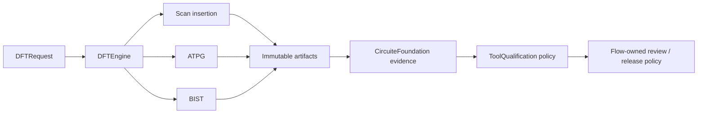

# DFTEngine

Scan, ATPG and built-in self-test transformation contracts.

## Status

This repository contains typed DFT contracts, canonical gate-level scan and
scan-compression transformation, process-scoped scan-cell and Liberty timing
validation, bounded gate-level ATPG, independently verified process-specific
fault-model injection with capture-timing evidence, process-bound logic- and
memory-BIST transformation, external-tool execution, retained oracle
correlation, immutable Foundation artifact stores, and a headless JSON CLI.

The compact `DFTTestPatternSet` remains JSON-only.
`DeterministicTestPatternCodec` rejects direct STIL and WGL requests because
that compact coverage index does not carry cycle-accurate execution semantics.
For an uncompressed realized scan implementation, ATPG separately emits a
digest-bound `DFTScanPatternExecutionPlan` containing exact serial load,
functional capture, primary-output compare, and serial unload semantics.
`DFTPatternExchange` converts that neutral plan into its rich model and the
accepted STIL subset. Unsupported compression, multiple clock domains, falling
edge capture, oversized exhaustive spaces, or incomplete realized mappings
fail with typed errors; they are not approximated.

The accepted production-provider boundary is recorded in
[`docs/adr/0001-production-dft-provider.md`](docs/adr/0001-production-dft-provider.md).
It keeps the compact ATPG result, the standard-neutral execution plan, the rich
STIL exchange model, and independent retained-artifact replay separate.
`DFTPatternExchange` validates, converts, and round-trips the accepted STIL
subset from retained bytes. `IcarusDFTScanPatternReplayProvider` independently
reopens and verifies the STIL, scan netlist, realized scan implementation,
fault universe, and cell-model artifacts before compiling a deterministic
replay harness. Real hosted replay and corpus qualification remain external
gates.

Scan insertion now retains those scan semantics separately from the estimated
architecture plan. `DFTScanImplementation` records the source/transformed
design digests, exact chain order, and every transformed cell's data, output,
clock, scan-input, scan-enable, and test-mode pin/net binding. The payload and
retained JSON artifact must match during semantic verification. ATPG loads that
artifact through `DFTScanImplementationLoading`, verifies its identity, and
produces an immutable execution-plan artifact. Native semantic verification
replays the plan against the retained transformed design and rejects mismatched
primary-output or scan-unload expectations.

The CLI and Xcircuite composition load every digest-bound, mode-specific SDC
artifact and verify declared DFT clocks plus asserted test-mode/scan-enable
case analysis before execution. Missing loaders, missing modes, duplicate
modes, conflicting case analysis, and artifact identity failures produce
`DFT_CONSTRAINT_VALIDATION_FAILED`; constraints are not provenance-only inputs.



## Products

| Product | Responsibility |
|---|---|
| `DFTCore` | Shared DFT request, result, realized-scan reference, and standard-neutral execution contract |
| `ScanInsertion` | Scan architecture, insertion, and exact realized chain-binding evidence |
| `ATPGEngine` | Pattern generation and fault coverage |
| `BISTEngine` | Memory and logic BIST |
| `DFTPatternExchange` | Neutral-plan conversion, rich cycle/timing/procedure model, and fail-closed STIL subset codec |
| `DFTExternalTools` | Digest-bound process execution, OpenROAD ScanDEF/Verilog canonical import, and independent retained-STIL replay with raw fault observations |
| `DFTEngine` | Umbrella API |

The native implementations are:

| Backend | Output | Explicit limitation |
|---|---|---|
| `DeterministicScanInsertionEngine` | digest-verified gate transformation, canonical port/net bindings, Liberty-validated replacement cells, process-mapped compression helpers, scan plan and design diff | Functional equivalence and process qualification remain downstream gates |
| `DeterministicATPGEngine` | simulated declared/extracted stuck-at and transition ATPG with explicit sequential contracts; exact realized-scan shift/capture/compare plan generation; injected process-specific models with a distinct pattern verifier and clock-bound capture timing | Hosted Icarus correlation, independent process corpora, compressed-pattern execution, and ToolQualification evidence remain external gates |
| `DeterministicBISTEngine` | process-bound logic- and memory-BIST transformations, explicit helper/macro mapping, structure and design diff | Macro/helper-cell process qualification remains an external gate |
| `DFTResult` | Domain result with direct `ArtifactProducing`, `EvidenceProviding`, and `DiagnosticReporting` conformance | Retains immutable artifacts, provenance, and typed diagnostics without projection |
| `DefaultDFTEngine` | Direct `DFTEngineExecuting` implementation | Returns the domain-owned `DFTResult` |

## Contract

Every executing product uses:

- a `CircuiteFoundation.Engine`-compatible, protocol-first execution surface;
- a `Codable`, `Hashable`, `Sendable` request conforming to `DFTExecutionRequest`;
- `DFTResult` for status, diagnostics, Foundation artifacts and execution metadata;
- protocol-first dependency injection;
- immutable Foundation `ArtifactReference` inputs and outputs;
- explicit blocked, failed and cancelled states.

Domain engines return `DFTResult` directly. The result itself publishes verified
artifacts, diagnostics, and execution provenance without a wrapper.

`DFTResultValidator` validates the self-contained result contract.
`DFTResultSemanticVerifier` separately reopens immutable PDK, cell-library,
mapping, source, and transformed artifacts; verifies their identities and PDK
semantics; decodes canonical LogicDesign state; and checks exact scan-chain and
logic-BIST connectivity. ATPG completion additionally requires an injected
`DFTATPGResultSemanticVerifying` implementation. The native verifier replays
every detected stuck-at and transition pattern. Flow, external-tool, and release
integrations use the same verifier before accepting a completed result.
When ATPG consumes realized scan evidence, the verifier also reopens that
artifact and the retained execution-plan artifact, checks exact byte identity,
and replays load, capture, primary-output compare, and unload behavior.

## Flow integration

Xcircuite records every DFT mutation as a new LogicDesignReference and requires formal equivalence or approved test-mode exceptions before physical design.

The library does not depend on the Xcircuite runtime. The owning flow package
connects `DFTResult` to `DesignFlowKernel`, artifact persistence,
ToolQualification decisions, repair loops and human approval.

## Oracle evidence

`DFTOracleCorpus` describes process-scoped cases with request digests, normalized oracle expectation artifacts and PDK identity. `DFTOracleCorrelationEngine` verifies retained artifact byte counts and SHA-256 digests, decodes the normalized expectations, compares native results and emits raw correlation observations with a deterministic digest. It does not promote those observations to trusted-tool or release status; ToolQualification and the composing flow policy own that decision.

Process-specific ATPG is intentionally an integration boundary.
`DFTProcessFaultModeling` generates the candidate outcome while the separately
injected `DFTProcessFaultPatternVerifying` implementation validates it. Their
identities must be non-empty and distinct. A detected outcome must also retain
`DFTProcessCaptureTiming` bound to a declared DFT clock, a finite
launch-to-capture interval within that clock period, a valid sample offset, and
explicit assumptions. `DFTResultValidator` enforces the same evidence contract
for native and external completed results. Model injection and verification are
not process qualification; independent corpus and ToolQualification evidence
remain required before release.

Logic BIST requires a process- and PDK-bound helper-cell mapping artifact.
`DFTLogicBISTCellMappingLoading` owns loading and identity verification; the
native BIST engine compares the decoded immutable manifest with the inline
request contract before transforming the design. The transformed helper cells
retain pattern count, deterministic seed, PRPG taps, MISR taps, response width,
and expected signature as typed LogicIR parameters; semantic validation checks
those parameters, preserves RTL plus every non-top module and functional
top-level port/net identity, and checks the exact generated port, pin, mux,
capture, compactor, control, clock, and signature connectivity. A missing
loader or mismatch blocks execution.

Memory BIST uses a separate process- and PDK-bound mapping contract for the
controller, input mux, response compactor, signature register, supported macro
types, and supported algorithms. `DFTGateLevelMemoryBISTTransformer` verifies
that target instances and macro bindings match exactly, checks macro pin
directions and connectivity, rejects cross-clock-domain groups, inserts the
test-mode mux/control/compaction network, and persists the transformed
canonical snapshot, design diff, and BIST structure. Mapping bytes are loaded
and digest-checked independently of the inline request contract. External
memory backends remain available, but completed results without transformed
evidence are rejected.

Scan compression keeps architecture and process data separate.
`DFTCompressionConfiguration` owns only the compression ratio and external
channel names. `DFTScanCompressionCellMapping`, stored in the process-scoped
cell-library manifest, owns cell and pin names. The transformer requires exact
coverage of every external channel and internal chain and rejects missing,
duplicate, or incomplete mappings.

Multi-artifact output uses `storeBatch`. The filesystem implementation stages a
complete immutable batch and publishes it with one directory rename; the
in-memory actor validates the whole batch before mutating storage. Artifact paths
therefore include a deterministic batch directory. Concurrent store instances
accept a byte-identical winning publication and reject a conflicting batch.

External backends bind their descriptor to the SHA-256 digest of the executable.
The process runner verifies the executable before and after execution, and a
completed external mutation is accepted only when an artifact reader is
available for the same semantic verification used by native backends.

The Icarus replay provider is a separate observation producer. It accepts only
retained SHA-256-addressed STIL, Verilog, realized-scan, fault-universe, and
cell-model artifacts. Selected fault IDs are resolved from the retained
universe, never from caller-supplied paths. Golden mismatch, unknown compare,
invalid result markers, executable substitution, timeout, and cancellation
fail through typed errors. The returned result contains raw observations and
semantic input digests; it does not contain a trust or production verdict.

The OpenROAD scan importer is a separate canonicalization boundary. It reopens
retained pre-scan Verilog, post-scan Verilog, DEF `SCANCHAINS`, the
process-bound DFT cell-library manifest, and raw execution evidence. It parses
both netlists through `LogicIR`, validates chain endpoints/order and every
cell/pin/net binding, then atomically retains source/transformed canonical
snapshots, `DFTScanImplementation`, and import evidence. It does not launch
OpenROAD or qualify the producer.

## Build

`Package.swift` resolves every dependency independently. A sibling checkout is
used when its `Package.swift` exists; otherwise SwiftPM uses the pinned GitHub
revision. No umbrella repository is required.

| Dependency | Local sibling | Remote fallback revision |
|---|---|---|
| CircuiteFoundation | `../CircuiteFoundation` | `7abcac83517935c9b9f7553d7016d62cffde259d` |
| LogicDesign | `../LogicDesign` | `4894cd89862f43300a3ca9d4cf73b3d9e6034626` |
| TimingEngine | `../TimingEngine` | `709af87cf5c898d47605b0ab287786828ee2267c` |
| PDKKit | `../PDKKit` | `b62c5ad7e5819a24977038c2133856caed52f481` |
| SignoffToolSupport | `../SignoffToolSupport` | `6bf675eecb27e3bd3440c5ce8a85c85c510fc3cb` |

```bash
swift build
```

## Test

```bash
timeout 240 xcodebuild test -scheme DFTEngine-Package -destination 'platform=macOS' -parallel-testing-enabled NO
```

The contract suite covers positive transformations, blocked prerequisites,
internal pattern-codec round trips, external-tool identity and exit checks,
immutable artifact stores, Foundation evidence identity, oracle correlation,
native memory-BIST transformation, and scan-compression connectivity. A
2,048-chain regression also enforces a five-second debug-test budget; the
2026-07-26 arm64 Xcode run completed that regression in 1.36 seconds after
replacing repeated port-binding scans and per-chain sorts with indexed updates.
The STIL exchange suite independently round-trips checked-in bytes and enforces
a five-second debug-test budget for encoding and streaming decode of 20,000
fully assigned cycles. Decode retains the input `Data`, reads it by byte offset,
and materializes only semantic values retained by the returned program; it does
not create whole-file `String`, `[Character]`, or token-array copies.
The independent replay suite covers retained-input integrity, scan/fault
identity binding, deterministic harness construction, golden and fault output
parsing, executable identity, timeout, cancellation, and atomic evidence
persistence. The CLI replay integration covers the filesystem request,
descriptor, provider, and retained-result path. Real Icarus execution is still
required in the hosted production profile before qualification is claimed.

See `DESIGN.md`, `INTERFACES.md` and `IMPLEMENTATION_PLAN.md` before implementing a backend.

See `MILESTONES.md` for the platform-level completion gates. A deterministic artifact is evidence of reproducibility, not evidence of process qualification.

## CLI

```bash
swift run dft-engine capabilities
mkdir -p /tmp/dft-project
cp Tests/DFTEngineTests/Fixtures/design.json /tmp/dft-project/design.json
cp Tests/DFTEngineTests/Fixtures/cell-library.json /tmp/dft-project/cell-library.json
cp Tests/DFTEngineTests/Fixtures/cell-timing.lib /tmp/dft-project/cell-timing.lib
cp Tests/DFTEngineTests/Fixtures/constraints.sdc /tmp/dft-project/constraints.sdc
cp Tests/DFTEngineTests/Fixtures/pdk.json /tmp/dft-project/pdk.json
swift run dft-engine execute \
  --request Tests/DFTEngineTests/Fixtures/scan-request.json \
  --output-dir /tmp/dft-project \
  --result /tmp/dft-result.json

swift run dft-engine import-openroad-scan \
  --request /tmp/dft-project/openroad-import-request.json \
  --output-dir /tmp/dft-project \
  --result /tmp/dft-openroad-import-result.json

swift run dft-engine convert-scan-pattern \
  --plan /tmp/dft-project/execution-plan.json \
  --name production_scan \
  --format stil \
  --result /tmp/dft-project/production-scan.stil

swift run dft-engine replay \
  --request /tmp/dft-project/replay-request.json \
  --output-dir /tmp/dft-project \
  --compiler /opt/lsi/bin/iverilog \
  --compiler-descriptor /tmp/dft-project/iverilog-descriptor.json \
  --simulator /opt/lsi/bin/vvp \
  --simulator-descriptor /tmp/dft-project/vvp-descriptor.json \
  --result /tmp/dft-replay-result.json
```

The CLI preserves the complete DFT result and writes artifacts below
`dft/runs/<run-id>/`. Exit codes are:

| Exit code | Meaning |
|---:|---|
| `0` | Completed successfully |
| `1` | Execution or CLI failure |
| `2` | Structurally blocked request; never a passing result |
| `3` | Cancelled execution |

`capabilities` emits deterministic JSON. `execute` rejects unknown,
duplicate and missing options before reading the request. Blocked results
retain typed diagnostic codes and suggested actions for Agent and human
review.

`replay` accepts a `DFTScanPatternReplayRequest` plus separately retained
compiler and simulator descriptors. It passes both executable paths and
expected SHA-256 identities to `IcarusDFTScanPatternReplayProvider`; the CLI
does not reconstruct STIL, scan connectivity, fault semantics, or a trust
verdict. Optional timeout values control process execution, while tool
qualification remains outside this package.

`import-openroad-scan` accepts `OpenROADDFTScanImportRequest` and delegates to
`OpenROADDFTScanImporter`. The workflow supplies retained tool outputs and a
digest-bound producer descriptor; the importer owns standard-data parsing and
canonical connectivity validation, while ToolQualification owns producer trust.

`convert-scan-pattern` accepts the neutral
`DFTScanPatternExecutionPlan`, validates its complete scan/capture topology
through `DFTScanPatternExchangeConverter`, and serializes the accepted STIL
subset through `STILPatternCodec`. The CLI does not reconstruct cycles or
waveform semantics.

Artifact stores are immutable: repeating the same artifact write is idempotent, while replacing bytes at an existing run path is rejected.

## Evidence and trust boundary

`DFTOracleCorrelationEngine` verifies retained oracle artifacts by path,
artifact ID, byte count and SHA-256 before comparing the native result with
the expected result. `DFTPayload.evidenceProvenance` records raw evidence
maturity through `smokeObserved`, `corpusObserved`, or `oracleCorrelated` plus
the supporting corpus, oracle, process, PDK, and request identities. These are
observations, not a ToolQualification decision or a release verdict.

ToolQualification evaluates implementation trust from retained evidence. The
composing DesignFlowKernel/Xcircuite flow owns downstream evidence policy,
human approval, resume, and release eligibility. DFTEngine has no DFT-specific
qualification or release-gate API.

Release downstream evidence is composed by the flow layer. DFTEngine does not
create, evaluate, or promote release bundles.

Process-specific ATPG semantics are provided through the injected
`DFTProcessFaultModeling` protocol. A declared process family without an
injected and validated model remains blocked.

## Xcircuite integration

The owning flow integration executes a project-relative request headlessly,
injects either a test double or `DefaultDFTEngine`, verifies returned
Foundation artifact integrity, reopens completed mutation artifacts through
`DFTResultSemanticVerifier`, and maps the result to its flow stage result.
