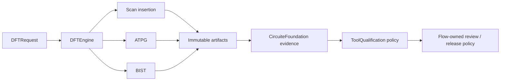

# DFTEngine

Scan, ATPG and built-in self-test transformation contracts.

## Status

This repository contains the typed DFT contracts, a canonical gate-level scan transformation, process-scoped scan-cell binding, Liberty timing/legal-cell validation, gate-level combinational and bounded sequential ATPG, explicit reset/set and transition semantics, an explicit process-specific fault-model boundary, canonical logic-BIST transformation, a typed memory-macro execution boundary, strict STIL/WGL codecs, external-tool execution, retained oracle correlation, immutable Foundation artifact stores, and a headless JSON CLI.

The native execution and evidence contracts through M7 are implemented and tested. STIL and WGL keep standards-compatible pattern syntax while a deterministic comment metadata record preserves the complete per-pattern fault-ID mapping across codec round trips. Production qualification remains intentionally gated by independently generated PDK, macro, oracle, equivalence, DRC, LVS, PEX and human-review evidence. No backend self-promotes fixture or smoke evidence to foundry qualification.



## Products

| Product | Responsibility |
|---|---|
| `DFTCore` | Shared DFT request and result contract |
| `ScanInsertion` | Scan architecture and insertion |
| `ATPGEngine` | Pattern generation and fault coverage |
| `BISTEngine` | Memory and logic BIST |
| `DFTEngine` | Umbrella API |

The native implementations are:

| Backend | Output | Explicit limitation |
|---|---|---|
| `DeterministicScanInsertionEngine` | digest-verified gate snapshot transformation, scan plan, transformed design reference, design diff | Does not infer qualified clock/reset semantics, prove cell legality or prove functional equivalence |
| `DeterministicATPGEngine` | declared-fault ATPG, extracted combinational stuck-at ATPG, bounded DFF/SDFF state ATPG, explicit reset/set contracts, level-sensitive latch semantics, directed combinational/sequential transition ATPG and injected process-specific fault-model evaluation | Unknown primitives and process-qualified timing block coverage; `supportedProcessFamilies` is declarative only and does not replace a separately qualified injected model |
| `DeterministicBISTEngine` | canonical logic-BIST gate transformation, structure, design diff | Native memory macros and helper-cell legality remain blocked pending qualification; external memory execution validates the typed DFT contract while the composing flow applies tool trust policy |
| `DFTResult` | Domain result with direct `ArtifactProducing`, `EvidenceProviding`, and `DiagnosticReporting` conformance | Retains immutable artifacts, provenance, and typed diagnostics without projection |
| `DefaultDFTEngine` | Direct `DFTEngineExecuting` implementation | Returns the domain-owned `DFTResult` |

## Contract

Every executing product uses:

- a `CircuiteFoundation.Engine`-compatible, protocol-first execution surface;
- a `Codable`, `Hashable`, `Sendable` request conforming to `DFTExecutionRequest`;
- `DFTResult` for status, diagnostics, Foundation artifacts and execution metadata;
- protocol-first dependency injection;
- immutable Foundation `ArtifactReference` inputs and outputs;
- explicit blocked, failed and cancelled states.

Domain engines return `DFTResult` directly. The result itself publishes verified
artifacts, diagnostics, and execution provenance without a wrapper.

## Flow integration

Xcircuite records every DFT mutation as a new LogicDesignReference and requires formal equivalence or approved test-mode exceptions before physical design.

The library does not depend on the Xcircuite runtime. The owning flow package
connects `DFTResult` to `DesignFlowKernel`, artifact persistence,
ToolQualification decisions, repair loops and human approval.

## Oracle evidence

`DFTOracleCorpus` describes process-scoped cases with request digests, normalized oracle expectation artifacts and PDK identity. `DFTOracleCorrelationEngine` verifies retained artifact byte counts and SHA-256 digests, decodes the normalized expectations, compares native results and emits raw correlation observations with a deterministic digest. It does not promote those observations to trusted-tool or release status; ToolQualification and the composing flow policy own that decision.

Process-specific ATPG is intentionally an integration boundary. `DFTProcessFaultModeling` is injected by the integrating project and returns a typed result that the engine validates before creating a pattern or coverage outcome. Model injection is not process qualification; the result still requires independent oracle and ToolQualification evidence before release.

## Build

`Package.swift` resolves every dependency independently. A sibling checkout is
used when its `Package.swift` exists; otherwise SwiftPM uses the pinned GitHub
revision. No umbrella repository is required.

| Dependency | Local sibling | Remote fallback revision |
|---|---|---|
| CircuiteFoundation | `../CircuiteFoundation` | `7abcac83517935c9b9f7553d7016d62cffde259d` |
| LogicDesign | `../LogicDesign` | `b9aa25b0b78e6168befa25df3bfe8309bd020a6d` |
| TimingEngine | `../TimingEngine` | `baada25223ccc1225afefa672120ba0d7d1d5d41` |
| PDKKit | `../PDKKit` | `b62c5ad7e5819a24977038c2133856caed52f481` |
| SignoffToolSupport | `../SignoffToolSupport` | `9a00065522ae527342c87380f0e7faa87e7cca9f` |

```bash
swift build
```

## Test

```bash
timeout 240 xcodebuild test -scheme DFTEngine-Package -destination 'platform=macOS' -parallel-testing-enabled NO
```

The current contract suite contains 52 tests in 6 suites. The test suite
covers positive transformations, blocked prerequisites, standard-pattern
round trips, external-tool identity and exit checks, immutable artifact stores,
Foundation evidence identity, oracle correlation and raw memory-BIST adapter validation.

See `DESIGN.md`, `INTERFACES.md` and `IMPLEMENTATION_PLAN.md` before implementing a backend.

See `MILESTONES.md` for the platform-level completion gates. A deterministic artifact is evidence of reproducibility, not evidence of process qualification.

## CLI

```bash
swift run dft-engine capabilities
mkdir -p /tmp/dft-project
cp Tests/DFTEngineTests/Fixtures/design.json /tmp/dft-project/design.json
cp Tests/DFTEngineTests/Fixtures/cell-library.json /tmp/dft-project/cell-library.json
swift run dft-engine execute \
  --request Tests/DFTEngineTests/Fixtures/scan-request.json \
  --output-dir /tmp/dft-project \
  --result /tmp/dft-result.json
```

The CLI preserves the complete DFT result and writes artifacts below
`dft/runs/<run-id>/`. Exit codes are:

| Exit code | Meaning |
|---:|---|
| `0` | Completed successfully |
| `1` | Execution or CLI failure |
| `2` | Structurally blocked request; never a passing result |
| `3` | Cancelled execution |

`capabilities` emits deterministic JSON. `execute` rejects unknown,
duplicate and missing options before reading the request. Blocked results
retain typed diagnostic codes and suggested actions for Agent and human
review.

Artifact stores are immutable: repeating the same artifact write is idempotent, while replacing bytes at an existing run path is rejected.

## Evidence and trust boundary

`DFTOracleCorrelationEngine` verifies retained oracle artifacts by path,
artifact ID, byte count and SHA-256 before comparing the native result with
the expected result. `DFTPayload.evidenceProvenance` records raw evidence
maturity through `smokeObserved`, `corpusObserved`, or `oracleCorrelated` plus
the supporting corpus, oracle, process, PDK, and request identities. These are
observations, not a ToolQualification decision or a release verdict.

ToolQualification evaluates implementation trust from retained evidence. The
composing DesignFlowKernel/Xcircuite flow owns downstream evidence policy,
human approval, resume, and release eligibility. DFTEngine has no DFT-specific
qualification or release-gate API.

Release downstream evidence is composed by the flow layer. DFTEngine does not
create, evaluate, or promote release bundles.

Process-specific ATPG semantics are provided through the injected
`DFTProcessFaultModeling` protocol. A declared process family without an
injected and validated model remains blocked.

## Xcircuite integration

The owning flow integration executes a project-relative request headlessly,
injects either a test double or `DefaultDFTEngine`, verifies returned
Foundation artifact integrity, and maps the result to its flow stage result.
